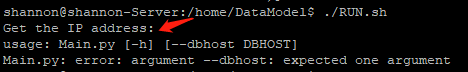
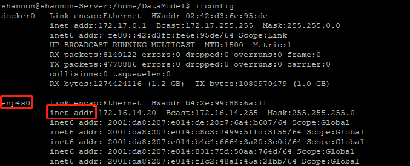
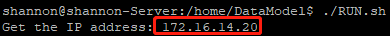

# DataModel
Build a system to train data model

# 安装步骤 (已验证)
1. 安装时切换到root用户，以此保证python的包被安装到系统目录。
1. Update package source: `sudo apt-get update`
1. Install mysql server: `sudo apt-get install mysql-server`. // 如果安装的是5.7的版本就不会再安装过程中提醒设置root密码 此时需要利用/etc/mysql/debian.cnf文件中的用户和密码登录 然后执行 `update mysql.user set authentication_string=password('your password') where user='root'and Host = 'localhost';`命令reset root的密码
1. Install python: `sudo apt-get install python2.7`
1. Install pip module: `sudo apt-get install python-pip`
1. Install MySQLdb module: `sudo apt-get install libmysqlclient-dev`, and `sudo pip install mysql-python`
1. Create some tables. Please execute the file CreateTable.py: `python CreateTable.py`

# 系统配置
1. 开启MySQL的binlog服务，方便数据的备份以及恢复等操作。https://blog.csdn.net/weixin_38187469/article/details/79273962
2. docker需要设置日志的大小限制等，避免占满磁盘的空间。

# DataModel配置
1. Modify Config.py to update Database's info.
2. If you want to run the specific date data, you can modify the function `get_range_times` and `get_date_day` in this file `CommonUtil.py`.
3. If you want to output debug info, you can update the **LOGGER_LEVEL** of Config.py to DEBUG.

# 利用CPython对code编译成.so文件
  python Encryption.py build_ext --inplace 如果报错，可以试一试用sudo来执行

# 安装MySQL或mysql-python的FQA
1. Issue 1: 'this is MySQLdb version (1, 2, 5, 'final', 1), but _mysql is version (1, 4, 1, 'final', 0)'.

    You can uninstall MySQLdb `sudo pip uninstall mysql-python`, and go to `/usr/local/lib/python2.7/dist-packages/`, then `sudo rm -rf MySQLdb`. Finally, you can re-install mysql-python. It should wrok.

1. Issue2: 'Can't connect to MySQL server on 'x.x.x.x''.

    需要更新 my.cnf of MySQL. 路径在 `/etc/mysql/mysql.conf.d/mysqld.cnf`, 然后注释掉 `bind-address = 127.0.0.1` 即可

1. Fatal error: my_config.h: 没有那个文件或目录
    sudo apt-get install libmysqld-dev

1. Error: command 'x86_64-linux-gnu-gcc' failed with exit status 1
    sudo apt-get install python-dev build-essential libssl-dev libffi-dev libxml2-dev libxslt1-dev zlib1g-dev

1. 使用apt-get install按照package的过程中，出现依赖包找不到。
    用sudo aptitude install的方式安装相应的依赖包或者该package。如果机器上没有aptitude，请先安装: sudo apt-get install aptitude
    aptitude相对于apt-get在依赖的安装上更为聪明。

# MySQL性能优化
1. 关闭不必要表的日志.
    alter table table1 nologging;
2. 修改my.cnf参数
    binlog_format=ROW
    innodb_buffer_pool_size = 2147483648 # 2G 建议物理内存的75%

# 运行DataModel的FQA
1. 运行RUN.sh时，提示Main.py: error: argument --dbhost: expected one argument。
    错误原因：无法正常获取IP地址。

    

    解决方案：修改RUN.sh中获取IP地址的代码。

    执行ifconfig，信息如下

    

    修改RUN.sh中的代码

    

    正常执行后，显示获取IP地址

    